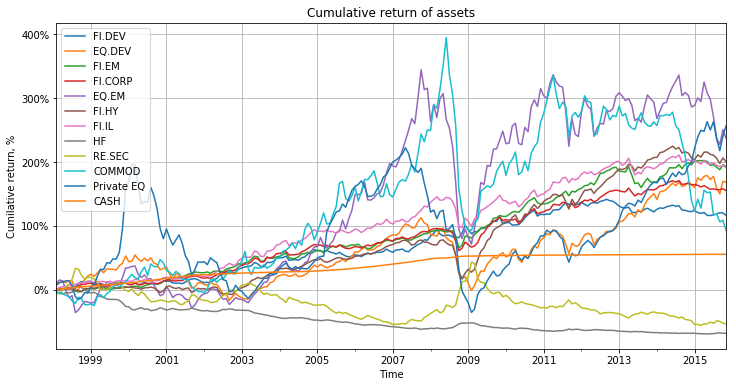
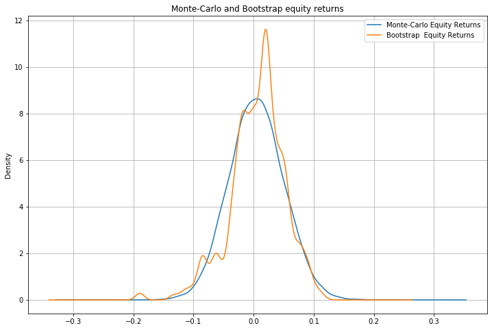

# Old Modern portfolio theory

## Efficient frontier, VaR, Expected Shortfall, Bootstrap, Monte-Carlo

In this tutorial, we're going to calculate the efficient frontier based on historical and forecasted data, and then generate some forward-looking returns.

As a starting point we'll use returns of 12 asset classes, namely developed markets bonds(FI.DEV), developed markets equities(EQ.DEV), emerging market bonds (FI.EM), corporate bonds(FI.CORP), emerging market equities(EQ.EM), high yield bonds(FI.HY), inflation-linked bonds(FI.IL), hedge funds(HF), real estate securities(RE.SEC), commodities(COMMOD), private equity(PRIV.EQ), bills(CASH).


```python
#loadind required libraries
import numpy as np
import pandas as pd
import matplotlib.pyplot as plt
from scipy.stats import norm

import cvxopt as opt
from cvxopt import blas, solvers
```


```python
#some formatting
pd.options.display.float_format = '{:.3f}%'.format #this is to format pandas dataframes nicely
from IPython.core.interactiveshell import InteractiveShell
InteractiveShell.ast_node_interactivity = "all" #this is just to show all output for any cell, not the last operator output
solvers.options['show_progress'] = False # Turn off progress printing
```


```python
myPath = r'D:\Serega\Education\!Interviews\Portfolio\SAA_portfolio\Data_Source.xlsx'
```


```python
returns = pd.read_excel(myPath, index_col=0)
```


```python
returns.head(2)
print('...')
returns.tail(2)
```


<div>
<style scoped>
    .dataframe tbody tr th:only-of-type {
        vertical-align: middle;
    }

    .dataframe tbody tr th {
        vertical-align: top;
    }

    .dataframe thead th {
        text-align: right;
    }
</style>
<table border="1" class="dataframe">
  <thead>
    <tr style="text-align: right;">
      <th></th>
      <th>FI.DEV</th>
      <th>EQ.DEV</th>
      <th>FI.EM</th>
      <th>FI.CORP</th>
      <th>EQ.EM</th>
      <th>FI.HY</th>
      <th>FI.IL</th>
      <th>HF</th>
      <th>RE.SEC</th>
      <th>COMMOD</th>
      <th>Private EQ</th>
      <th>CASH</th>
    </tr>
  </thead>
  <tbody>
    <tr>
      <th>1998-02-28</th>
      <td>0.007%</td>
      <td>0.068%</td>
      <td>-0.001%</td>
      <td>0.004%</td>
      <td>0.104%</td>
      <td>0.005%</td>
      <td>0.013%</td>
      <td>-0.032%</td>
      <td>-0.055%</td>
      <td>-0.053%</td>
      <td>0.080%</td>
      <td>0.004%</td>
    </tr>
    <tr>
      <th>1998-03-31</th>
      <td>-0.009%</td>
      <td>0.043%</td>
      <td>0.009%</td>
      <td>-0.005%</td>
      <td>0.042%</td>
      <td>0.010%</td>
      <td>0.023%</td>
      <td>-0.029%</td>
      <td>-0.008%</td>
      <td>0.010%</td>
      <td>0.028%</td>
      <td>0.005%</td>
    </tr>
  </tbody>
</table>
</div>


    ...
    


<div>
<style scoped>
    .dataframe tbody tr th:only-of-type {
        vertical-align: middle;
    }

    .dataframe tbody tr th {
        vertical-align: top;
    }

    .dataframe thead th {
        text-align: right;
    }
</style>
<table border="1" class="dataframe">
  <thead>
    <tr style="text-align: right;">
      <th></th>
      <th>FI.DEV</th>
      <th>EQ.DEV</th>
      <th>FI.EM</th>
      <th>FI.CORP</th>
      <th>EQ.EM</th>
      <th>FI.HY</th>
      <th>FI.IL</th>
      <th>HF</th>
      <th>RE.SEC</th>
      <th>COMMOD</th>
      <th>Private EQ</th>
      <th>CASH</th>
    </tr>
  </thead>
  <tbody>
    <tr>
      <th>2015-10-31</th>
      <td>-0.002%</td>
      <td>0.080%</td>
      <td>0.027%</td>
      <td>0.006%</td>
      <td>0.071%</td>
      <td>0.030%</td>
      <td>0.007%</td>
      <td>-0.017%</td>
      <td>-0.062%</td>
      <td>0.011%</td>
      <td>0.071%</td>
      <td>-0.000%</td>
    </tr>
    <tr>
      <th>2015-11-30</th>
      <td>-0.017%</td>
      <td>-0.004%</td>
      <td>-0.008%</td>
      <td>-0.011%</td>
      <td>-0.039%</td>
      <td>-0.020%</td>
      <td>-0.012%</td>
      <td>-0.004%</td>
      <td>-0.020%</td>
      <td>-0.075%</td>
      <td>0.048%</td>
      <td>-0.000%</td>
    </tr>
  </tbody>
</table>
</div>


As per the output above, in the input file we have monthly returns for a number of assets from February 1998 to November 2015. It is a good data range because it includes the dotcom crysis, the mortgage buble and consequent recoveries. You can choose your own time horizon. 
If you want do download other data from the internet there is a number of packages to do that. Just don't forget to convert price data to returns.
Let's plot this returns to see relative performance of assets. 


```python
cumulative_returns = returns + 1
for i in range(1,returns.shape[0]):
    cumulative_returns.iloc[i,:] = cumulative_returns.iloc[i,:]*cumulative_returns.iloc[i-1,:]
cumulative_returns -= 1
```


```python
plt.figure(); 
cumulative_returns.plot(figsize=(12, 6)); 
plt.title('Cumulative return of assets');
plt.legend(loc='upper left');
plt.xlabel('Time');
plt.ylabel('Cumilative return, %');
plt.gca().set_yticklabels(['{:.0f}%'.format(x*100) for x in plt.gca().get_yticks()]);
plt.grid(True);
```


    <Figure size 432x288 with 0 Axes>





The worst performing classes are hedge funds and real estate securities. Maybe the indices chosen are not representative. However, since it is only an exercise, we'll leave averything as it is.
Let's calculate parameters of these returns.


```python
#function for historical VaR and CVaR calculation
def __return_sorted_columns(df):
    sorted_df = pd.DataFrame(columns=df.columns)
    for col in df:
        sorted_df[col] = sorted(df[col])
    return sorted_df

def var_historical(rtns, confidence=.95):
    sorted_rtns = __return_sorted_columns(rtns)
    ind = int(np.floor(len(rtns)*(1-confidence))) #better to take lower value to overestimate the risk than to underestimate it
    return sorted_rtns.iloc[ind-1]

def cvar_historical(rtns, confidence=.95):
    sorted_rtns = __return_sorted_columns(rtns)
    ind = int(np.floor(len(rtns)*(1-confidence))) #better to take lower value to overestimate the risk than to underestimate it
    return np.mean(sorted_rtns[0:ind])

def var_analytical(rtns, confidence=.95):
    mu = rtns.mean() # in some cases mean return may assumed to be zero
    std = rtns.std()
    return mu - std*norm.ppf(confidence)

def cvar_analytical(rtns, confidence=.95):
    mu = rtns.mean() # in some cases mean return may assumed to be zero
    std = rtns.std()
    return mu - std*norm.pdf(norm.ppf(confidence))/(1-confidence)


def calculateparameters(rtns, confidence=.95):
    """This function returns Mean return, Standard deviation, Historical VaR, Historical CVaR, Analytical VaR, Analytical CVaR
    Parameters
    ----------
    rtns (pandas dataframe): asset returns
    """
    mean_asset_rtn = rtns.mean()
    std_asset_rtn = rtns.std()
    VaR_hist = var_historical(rtns, confidence)
    CVaR_hist = cvar_historical(rtns, confidence)
    VaR_covar = var_analytical(rtns, confidence)
    CVaR_covar = cvar_analytical(rtns, confidence)
    params = pd.concat([mean_asset_rtn, std_asset_rtn,VaR_hist, CVaR_hist, VaR_covar, CVaR_covar], axis=1)
    params = params.transpose()
    params.index = ['Mean return','Standard deviation', 'Historical VaR', 'Historical CVaR', 
                    'Analytical VaR', 'Analytical CVaR']
    return params
```


```python
calculateparameters(returns)
```


<div>
<style scoped>
    .dataframe tbody tr th:only-of-type {
        vertical-align: middle;
    }

    .dataframe tbody tr th {
        vertical-align: top;
    }

    .dataframe thead th {
        text-align: right;
    }
</style>
<table border="1" class="dataframe">
  <thead>
    <tr style="text-align: right;">
      <th></th>
      <th>FI.DEV</th>
      <th>EQ.DEV</th>
      <th>FI.EM</th>
      <th>FI.CORP</th>
      <th>EQ.EM</th>
      <th>FI.HY</th>
      <th>FI.IL</th>
      <th>HF</th>
      <th>RE.SEC</th>
      <th>COMMOD</th>
      <th>Private EQ</th>
      <th>CASH</th>
    </tr>
  </thead>
  <tbody>
    <tr>
      <th>Mean return</th>
      <td>0.004%</td>
      <td>0.006%</td>
      <td>0.005%</td>
      <td>0.005%</td>
      <td>0.008%</td>
      <td>0.006%</td>
      <td>0.005%</td>
      <td>-0.005%</td>
      <td>-0.002%</td>
      <td>0.005%</td>
      <td>0.009%</td>
      <td>0.002%</td>
    </tr>
    <tr>
      <th>Standard deviation</th>
      <td>0.018%</td>
      <td>0.046%</td>
      <td>0.019%</td>
      <td>0.018%</td>
      <td>0.070%</td>
      <td>0.029%</td>
      <td>0.022%</td>
      <td>0.020%</td>
      <td>0.051%</td>
      <td>0.067%</td>
      <td>0.074%</td>
      <td>0.002%</td>
    </tr>
    <tr>
      <th>Historical VaR</th>
      <td>-0.030%</td>
      <td>-0.085%</td>
      <td>-0.028%</td>
      <td>-0.025%</td>
      <td>-0.105%</td>
      <td>-0.040%</td>
      <td>-0.034%</td>
      <td>-0.035%</td>
      <td>-0.070%</td>
      <td>-0.112%</td>
      <td>-0.113%</td>
      <td>0.000%</td>
    </tr>
    <tr>
      <th>Historical CVaR</th>
      <td>-0.036%</td>
      <td>-0.109%</td>
      <td>-0.047%</td>
      <td>-0.040%</td>
      <td>-0.163%</td>
      <td>-0.072%</td>
      <td>-0.050%</td>
      <td>-0.045%</td>
      <td>-0.090%</td>
      <td>-0.145%</td>
      <td>-0.168%</td>
      <td>-0.000%</td>
    </tr>
    <tr>
      <th>Analytical VaR</th>
      <td>-0.026%</td>
      <td>-0.070%</td>
      <td>-0.026%</td>
      <td>-0.025%</td>
      <td>-0.107%</td>
      <td>-0.042%</td>
      <td>-0.030%</td>
      <td>-0.038%</td>
      <td>-0.087%</td>
      <td>-0.105%</td>
      <td>-0.113%</td>
      <td>-0.001%</td>
    </tr>
    <tr>
      <th>Analytical CVaR</th>
      <td>-0.034%</td>
      <td>-0.089%</td>
      <td>-0.034%</td>
      <td>-0.033%</td>
      <td>-0.136%</td>
      <td>-0.054%</td>
      <td>-0.039%</td>
      <td>-0.047%</td>
      <td>-0.108%</td>
      <td>-0.133%</td>
      <td>-0.144%</td>
      <td>-0.002%</td>
    </tr>
  </tbody>
</table>
</div>


As we can see, historical VaR slightly overestimates the risk. It happens because we round the index of the historical return correspondent to the chosen confidence level.


We can generate expected returns using bootstrap or covariance based Monte-Carlo.


```python
def montecarlo(rtns, num_simulations = 10000, seed=1):
    '''Covariance based Monte-Carlo, returns are assumed to be normally distributed
    '''
    n_assets = rtns.shape[1]
    mean_asset_rtn = rtns.mean()
    std_asset_rtn = rtns.std()
    cormat = rtns.corr()
    np.random.seed(seed)
    rand_rtns = (np.random.normal(size=num_simulations*n_assets)).reshape(num_simulations,n_assets)
    cholesky_decomposition = (np.linalg.cholesky(cormat)).transpose()
    zscore = np.dot(rand_rtns, cholesky_decomposition)
    
    rtns_simulations = pd.DataFrame(columns=rtns.columns)
    #haven't found an elegant way to do this. Ended up with a loop. There should be some convenient function in numpy or pandas...
    for i in range(zscore.shape[0]):
        rtns_simulations.loc[i] = mean_asset_rtn + np.multiply(zscore[i,:],std_asset_rtn)
    return rtns_simulations

def bootstrap(rtns, num_simulations = 10000, chunksize = 3, seed=1):
    '''Takes historical data to generate returns
    '''
    n_returns = rtns.shape[0]
    if (chunksize<1):
        chunksize = 1
        print('Chunksize cannot be negative. chunksize is assumed to be 1')
        
    returns_local = rtns.append(rtns.iloc[0:(chunksize-1),:]) #this is to be able to take pieces from the end of the series
    chunks = num_simulations//chunksize
    rtns_simulations = pd.DataFrame(columns=rtns.columns)
    np.random.seed(seed)
    for idx in np.random.choice(n_returns, size=chunks, replace=True):
        rtns_simulations = rtns_simulations.append(returns_local.iloc[idx:(idx+chunksize),:])
    
    #adding variables which are lower than 
    fraction_period = num_simulations%chunksize
    if fraction_period:
        idx = np.random.randint(n_returns)
        rtns_simulations = rtns_simulations.append(returns_local.iloc[idx:(idx+fraction_period),:])
    
    return rtns_simulations
```


```python
bootstrap_returns = bootstrap(returns)
montecarlo_returns = montecarlo(returns)
```

Parameters of returns generated with bootstrap:


```python
calculateparameters(bootstrap_returns)
```


<div>
<style scoped>
    .dataframe tbody tr th:only-of-type {
        vertical-align: middle;
    }

    .dataframe tbody tr th {
        vertical-align: top;
    }

    .dataframe thead th {
        text-align: right;
    }
</style>
<table border="1" class="dataframe">
  <thead>
    <tr style="text-align: right;">
      <th></th>
      <th>FI.DEV</th>
      <th>EQ.DEV</th>
      <th>FI.EM</th>
      <th>FI.CORP</th>
      <th>EQ.EM</th>
      <th>FI.HY</th>
      <th>FI.IL</th>
      <th>HF</th>
      <th>RE.SEC</th>
      <th>COMMOD</th>
      <th>Private EQ</th>
      <th>CASH</th>
    </tr>
  </thead>
  <tbody>
    <tr>
      <th>Mean return</th>
      <td>0.004%</td>
      <td>0.006%</td>
      <td>0.005%</td>
      <td>0.005%</td>
      <td>0.008%</td>
      <td>0.005%</td>
      <td>0.005%</td>
      <td>-0.005%</td>
      <td>-0.003%</td>
      <td>0.005%</td>
      <td>0.008%</td>
      <td>0.002%</td>
    </tr>
    <tr>
      <th>Standard deviation</th>
      <td>0.018%</td>
      <td>0.046%</td>
      <td>0.019%</td>
      <td>0.018%</td>
      <td>0.069%</td>
      <td>0.029%</td>
      <td>0.022%</td>
      <td>0.020%</td>
      <td>0.051%</td>
      <td>0.067%</td>
      <td>0.074%</td>
      <td>0.002%</td>
    </tr>
    <tr>
      <th>Historical VaR</th>
      <td>-0.028%</td>
      <td>-0.084%</td>
      <td>-0.028%</td>
      <td>-0.025%</td>
      <td>-0.100%</td>
      <td>-0.039%</td>
      <td>-0.030%</td>
      <td>-0.035%</td>
      <td>-0.068%</td>
      <td>-0.107%</td>
      <td>-0.111%</td>
      <td>0.000%</td>
    </tr>
    <tr>
      <th>Historical CVaR</th>
      <td>-0.035%</td>
      <td>-0.107%</td>
      <td>-0.045%</td>
      <td>-0.039%</td>
      <td>-0.155%</td>
      <td>-0.071%</td>
      <td>-0.049%</td>
      <td>-0.045%</td>
      <td>-0.086%</td>
      <td>-0.144%</td>
      <td>-0.168%</td>
      <td>-0.000%</td>
    </tr>
    <tr>
      <th>Analytical VaR</th>
      <td>-0.026%</td>
      <td>-0.069%</td>
      <td>-0.026%</td>
      <td>-0.025%</td>
      <td>-0.105%</td>
      <td>-0.043%</td>
      <td>-0.030%</td>
      <td>-0.038%</td>
      <td>-0.086%</td>
      <td>-0.105%</td>
      <td>-0.113%</td>
      <td>-0.001%</td>
    </tr>
    <tr>
      <th>Analytical CVaR</th>
      <td>-0.034%</td>
      <td>-0.088%</td>
      <td>-0.034%</td>
      <td>-0.033%</td>
      <td>-0.134%</td>
      <td>-0.055%</td>
      <td>-0.039%</td>
      <td>-0.047%</td>
      <td>-0.108%</td>
      <td>-0.133%</td>
      <td>-0.144%</td>
      <td>-0.002%</td>
    </tr>
  </tbody>
</table>
</div>


Parameters of returns generated with Monte-Carlo:


```python
calculateparameters(montecarlo_returns)
```


<div>
<style scoped>
    .dataframe tbody tr th:only-of-type {
        vertical-align: middle;
    }

    .dataframe tbody tr th {
        vertical-align: top;
    }

    .dataframe thead th {
        text-align: right;
    }
</style>
<table border="1" class="dataframe">
  <thead>
    <tr style="text-align: right;">
      <th></th>
      <th>FI.DEV</th>
      <th>EQ.DEV</th>
      <th>FI.EM</th>
      <th>FI.CORP</th>
      <th>EQ.EM</th>
      <th>FI.HY</th>
      <th>FI.IL</th>
      <th>HF</th>
      <th>RE.SEC</th>
      <th>COMMOD</th>
      <th>Private EQ</th>
      <th>CASH</th>
    </tr>
  </thead>
  <tbody>
    <tr>
      <th>Mean return</th>
      <td>0.004%</td>
      <td>0.005%</td>
      <td>0.005%</td>
      <td>0.005%</td>
      <td>0.008%</td>
      <td>0.006%</td>
      <td>0.005%</td>
      <td>-0.005%</td>
      <td>-0.002%</td>
      <td>0.006%</td>
      <td>0.008%</td>
      <td>0.002%</td>
    </tr>
    <tr>
      <th>Standard deviation</th>
      <td>0.018%</td>
      <td>0.046%</td>
      <td>0.019%</td>
      <td>0.018%</td>
      <td>0.069%</td>
      <td>0.029%</td>
      <td>0.022%</td>
      <td>0.020%</td>
      <td>0.051%</td>
      <td>0.067%</td>
      <td>0.074%</td>
      <td>0.002%</td>
    </tr>
    <tr>
      <th>Historical VaR</th>
      <td>-0.026%</td>
      <td>-0.069%</td>
      <td>-0.026%</td>
      <td>-0.025%</td>
      <td>-0.107%</td>
      <td>-0.042%</td>
      <td>-0.030%</td>
      <td>-0.038%</td>
      <td>-0.086%</td>
      <td>-0.105%</td>
      <td>-0.113%</td>
      <td>-0.001%</td>
    </tr>
    <tr>
      <th>Historical CVaR</th>
      <td>-0.034%</td>
      <td>-0.088%</td>
      <td>-0.034%</td>
      <td>-0.032%</td>
      <td>-0.136%</td>
      <td>-0.054%</td>
      <td>-0.039%</td>
      <td>-0.046%</td>
      <td>-0.107%</td>
      <td>-0.131%</td>
      <td>-0.144%</td>
      <td>-0.002%</td>
    </tr>
    <tr>
      <th>Analytical VaR</th>
      <td>-0.026%</td>
      <td>-0.070%</td>
      <td>-0.026%</td>
      <td>-0.025%</td>
      <td>-0.106%</td>
      <td>-0.042%</td>
      <td>-0.030%</td>
      <td>-0.038%</td>
      <td>-0.086%</td>
      <td>-0.104%</td>
      <td>-0.114%</td>
      <td>-0.001%</td>
    </tr>
    <tr>
      <th>Analytical CVaR</th>
      <td>-0.034%</td>
      <td>-0.089%</td>
      <td>-0.034%</td>
      <td>-0.033%</td>
      <td>-0.135%</td>
      <td>-0.054%</td>
      <td>-0.039%</td>
      <td>-0.047%</td>
      <td>-0.108%</td>
      <td>-0.132%</td>
      <td>-0.145%</td>
      <td>-0.002%</td>
    </tr>
  </tbody>
</table>
</div>


As we can see, generated returns have almost the same parameters as our initial sample, which confirms that the generation functions work correctly.

Let's visualize the result, people love it. We can make a density plot for returns of equities.


```python
equity_returns_for_plotting = pd.concat([montecarlo_returns['EQ.DEV'], bootstrap_returns['EQ.DEV']],axis=1)
equity_returns_for_plotting.columns=['Monte-Carlo Equity Returns','Bootstrap  Equity Returns']
fig, ax = plt.subplots(figsize=(12, 8))
equity_returns_for_plotting.plot.kde(ax=ax, legend=True, title='Monte-Carlo and Bootstrap equity returns')
#equity_returns_for_plotting.plot.hist(density=True, ax=ax)
ax.grid(axis='x')
ax.grid(axis='y')
#ax.set_facecolor('#d8dcd6')
```


    <matplotlib.axes._subplots.AxesSubplot at 0x1e4d1d0dd68>





The return generated by Monte-Carlo is more smooth. Seems like bootstrap returns have fatter tails.

Let's annualize our monthly returns. We'll proceed with bootstrap returns.


```python
def returns_period_upscale(rtns, periodicity = 12, annualize_last = True):
    new_returns = pd.DataFrame(columns = rtns.columns)
    rtns += 1
    n_steps = rtns.shape[0]//periodicity
    
    for i in range(n_steps):
        new_returns.loc[i] = np.prod(rtns.iloc[(i*periodicity):((i+1)*periodicity)],axis=0)
    
    fraction_period = rtns.shape[0]%periodicity
    if fraction_period:
        new_returns.loc[n_steps] = np.prod(rtns.iloc[(n_steps*periodicity):],axis=0)
        if annualize_last: new_returns.loc[n_steps] = np.power(new_returns.loc[n_steps],periodicity/fraction_period)
    
    rtns -= 1 #python passes this dataframe by reference, and we don't want the internal function to make changes. I should've copied this Dataframe at the beginning of the function, and work with the copy. But I don't want to)
    
    return new_returns-1
```


```python
annual_returns = returns_period_upscale(bootstrap_returns)
```


```python
covmat, corrmat = [returns.cov(), returns.corr()]
corrmat.style.background_gradient(cmap='coolwarm').set_precision(2)
```


<style  type="text/css" >
    #T_b528f5e8_7b75_11e9_bcee_80c5f2b6775crow0_col0 {
            background-color:  #b40426;
            color:  #f1f1f1;
        }    #T_b528f5e8_7b75_11e9_bcee_80c5f2b6775crow0_col1 {
            background-color:  #d8dce2;
            color:  #000000;
        }    #T_b528f5e8_7b75_11e9_bcee_80c5f2b6775crow0_col2 {
            background-color:  #f5c4ac;
            color:  #000000;
        }    #T_b528f5e8_7b75_11e9_bcee_80c5f2b6775crow0_col3 {
            background-color:  #e9785d;
            color:  #000000;
        }    #T_b528f5e8_7b75_11e9_bcee_80c5f2b6775crow0_col4 {
            background-color:  #dadce0;
            color:  #000000;
        }    #T_b528f5e8_7b75_11e9_bcee_80c5f2b6775crow0_col5 {
            background-color:  #d3dbe7;
            color:  #000000;
        }    #T_b528f5e8_7b75_11e9_bcee_80c5f2b6775crow0_col6 {
            background-color:  #ee8468;
            color:  #000000;
        }    #T_b528f5e8_7b75_11e9_bcee_80c5f2b6775crow0_col7 {
            background-color:  #d7dce3;
            color:  #000000;
        }    #T_b528f5e8_7b75_11e9_bcee_80c5f2b6775crow0_col8 {
            background-color:  #dcdddd;
            color:  #000000;
        }    #T_b528f5e8_7b75_11e9_bcee_80c5f2b6775crow0_col9 {
            background-color:  #bbd1f8;
            color:  #000000;
        }    #T_b528f5e8_7b75_11e9_bcee_80c5f2b6775crow0_col10 {
            background-color:  #a5c3fe;
            color:  #000000;
        }    #T_b528f5e8_7b75_11e9_bcee_80c5f2b6775crow0_col11 {
            background-color:  #9fbfff;
            color:  #000000;
        }    #T_b528f5e8_7b75_11e9_bcee_80c5f2b6775crow1_col0 {
            background-color:  #7da0f9;
            color:  #000000;
        }    #T_b528f5e8_7b75_11e9_bcee_80c5f2b6775crow1_col1 {
            background-color:  #b40426;
            color:  #f1f1f1;
        }    #T_b528f5e8_7b75_11e9_bcee_80c5f2b6775crow1_col2 {
            background-color:  #edd2c3;
            color:  #000000;
        }    #T_b528f5e8_7b75_11e9_bcee_80c5f2b6775crow1_col3 {
            background-color:  #f2cbb7;
            color:  #000000;
        }    #T_b528f5e8_7b75_11e9_bcee_80c5f2b6775crow1_col4 {
            background-color:  #d24b40;
            color:  #f1f1f1;
        }    #T_b528f5e8_7b75_11e9_bcee_80c5f2b6775crow1_col5 {
            background-color:  #e9785d;
            color:  #000000;
        }    #T_b528f5e8_7b75_11e9_bcee_80c5f2b6775crow1_col6 {
            background-color:  #e3d9d3;
            color:  #000000;
        }    #T_b528f5e8_7b75_11e9_bcee_80c5f2b6775crow1_col7 {
            background-color:  #4055c8;
            color:  #f1f1f1;
        }    #T_b528f5e8_7b75_11e9_bcee_80c5f2b6775crow1_col8 {
            background-color:  #4e68d8;
            color:  #000000;
        }    #T_b528f5e8_7b75_11e9_bcee_80c5f2b6775crow1_col9 {
            background-color:  #ead5c9;
            color:  #000000;
        }    #T_b528f5e8_7b75_11e9_bcee_80c5f2b6775crow1_col10 {
            background-color:  #e57058;
            color:  #000000;
        }    #T_b528f5e8_7b75_11e9_bcee_80c5f2b6775crow1_col11 {
            background-color:  #465ecf;
            color:  #f1f1f1;
        }    #T_b528f5e8_7b75_11e9_bcee_80c5f2b6775crow2_col0 {
            background-color:  #ead4c8;
            color:  #000000;
        }    #T_b528f5e8_7b75_11e9_bcee_80c5f2b6775crow2_col1 {
            background-color:  #f7b89c;
            color:  #000000;
        }    #T_b528f5e8_7b75_11e9_bcee_80c5f2b6775crow2_col2 {
            background-color:  #b40426;
            color:  #f1f1f1;
        }    #T_b528f5e8_7b75_11e9_bcee_80c5f2b6775crow2_col3 {
            background-color:  #ee8468;
            color:  #000000;
        }    #T_b528f5e8_7b75_11e9_bcee_80c5f2b6775crow2_col4 {
            background-color:  #f7ad90;
            color:  #000000;
        }    #T_b528f5e8_7b75_11e9_bcee_80c5f2b6775crow2_col5 {
            background-color:  #f49a7b;
            color:  #000000;
        }    #T_b528f5e8_7b75_11e9_bcee_80c5f2b6775crow2_col6 {
            background-color:  #f39577;
            color:  #000000;
        }    #T_b528f5e8_7b75_11e9_bcee_80c5f2b6775crow2_col7 {
            background-color:  #93b5fe;
            color:  #000000;
        }    #T_b528f5e8_7b75_11e9_bcee_80c5f2b6775crow2_col8 {
            background-color:  #799cf8;
            color:  #000000;
        }    #T_b528f5e8_7b75_11e9_bcee_80c5f2b6775crow2_col9 {
            background-color:  #c1d4f4;
            color:  #000000;
        }    #T_b528f5e8_7b75_11e9_bcee_80c5f2b6775crow2_col10 {
            background-color:  #edd1c2;
            color:  #000000;
        }    #T_b528f5e8_7b75_11e9_bcee_80c5f2b6775crow2_col11 {
            background-color:  #7093f3;
            color:  #000000;
        }    #T_b528f5e8_7b75_11e9_bcee_80c5f2b6775crow3_col0 {
            background-color:  #ee8468;
            color:  #000000;
        }    #T_b528f5e8_7b75_11e9_bcee_80c5f2b6775crow3_col1 {
            background-color:  #f7ad90;
            color:  #000000;
        }    #T_b528f5e8_7b75_11e9_bcee_80c5f2b6775crow3_col2 {
            background-color:  #ed8366;
            color:  #000000;
        }    #T_b528f5e8_7b75_11e9_bcee_80c5f2b6775crow3_col3 {
            background-color:  #b40426;
            color:  #f1f1f1;
        }    #T_b528f5e8_7b75_11e9_bcee_80c5f2b6775crow3_col4 {
            background-color:  #f7b093;
            color:  #000000;
        }    #T_b528f5e8_7b75_11e9_bcee_80c5f2b6775crow3_col5 {
            background-color:  #f39778;
            color:  #000000;
        }    #T_b528f5e8_7b75_11e9_bcee_80c5f2b6775crow3_col6 {
            background-color:  #d44e41;
            color:  #000000;
        }    #T_b528f5e8_7b75_11e9_bcee_80c5f2b6775crow3_col7 {
            background-color:  #90b2fe;
            color:  #000000;
        }    #T_b528f5e8_7b75_11e9_bcee_80c5f2b6775crow3_col8 {
            background-color:  #9fbfff;
            color:  #000000;
        }    #T_b528f5e8_7b75_11e9_bcee_80c5f2b6775crow3_col9 {
            background-color:  #ead5c9;
            color:  #000000;
        }    #T_b528f5e8_7b75_11e9_bcee_80c5f2b6775crow3_col10 {
            background-color:  #e1dad6;
            color:  #000000;
        }    #T_b528f5e8_7b75_11e9_bcee_80c5f2b6775crow3_col11 {
            background-color:  #7295f4;
            color:  #000000;
        }    #T_b528f5e8_7b75_11e9_bcee_80c5f2b6775crow4_col0 {
            background-color:  #7b9ff9;
            color:  #000000;
        }    #T_b528f5e8_7b75_11e9_bcee_80c5f2b6775crow4_col1 {
            background-color:  #d24b40;
            color:  #f1f1f1;
        }    #T_b528f5e8_7b75_11e9_bcee_80c5f2b6775crow4_col2 {
            background-color:  #f1ccb8;
            color:  #000000;
        }    #T_b528f5e8_7b75_11e9_bcee_80c5f2b6775crow4_col3 {
            background-color:  #efcebd;
            color:  #000000;
        }    #T_b528f5e8_7b75_11e9_bcee_80c5f2b6775crow4_col4 {
            background-color:  #b40426;
            color:  #f1f1f1;
        }    #T_b528f5e8_7b75_11e9_bcee_80c5f2b6775crow4_col5 {
            background-color:  #e97a5f;
            color:  #000000;
        }    #T_b528f5e8_7b75_11e9_bcee_80c5f2b6775crow4_col6 {
            background-color:  #e1dad6;
            color:  #000000;
        }    #T_b528f5e8_7b75_11e9_bcee_80c5f2b6775crow4_col7 {
            background-color:  #3b4cc0;
            color:  #f1f1f1;
        }    #T_b528f5e8_7b75_11e9_bcee_80c5f2b6775crow4_col8 {
            background-color:  #536edd;
            color:  #000000;
        }    #T_b528f5e8_7b75_11e9_bcee_80c5f2b6775crow4_col9 {
            background-color:  #f2cab5;
            color:  #000000;
        }    #T_b528f5e8_7b75_11e9_bcee_80c5f2b6775crow4_col10 {
            background-color:  #ec7f63;
            color:  #000000;
        }    #T_b528f5e8_7b75_11e9_bcee_80c5f2b6775crow4_col11 {
            background-color:  #4f69d9;
            color:  #000000;
        }    #T_b528f5e8_7b75_11e9_bcee_80c5f2b6775crow5_col0 {
            background-color:  #8badfd;
            color:  #000000;
        }    #T_b528f5e8_7b75_11e9_bcee_80c5f2b6775crow5_col1 {
            background-color:  #e57058;
            color:  #000000;
        }    #T_b528f5e8_7b75_11e9_bcee_80c5f2b6775crow5_col2 {
            background-color:  #f7ac8e;
            color:  #000000;
        }    #T_b528f5e8_7b75_11e9_bcee_80c5f2b6775crow5_col3 {
            background-color:  #f7ac8e;
            color:  #000000;
        }    #T_b528f5e8_7b75_11e9_bcee_80c5f2b6775crow5_col4 {
            background-color:  #e67259;
            color:  #000000;
        }    #T_b528f5e8_7b75_11e9_bcee_80c5f2b6775crow5_col5 {
            background-color:  #b40426;
            color:  #f1f1f1;
        }    #T_b528f5e8_7b75_11e9_bcee_80c5f2b6775crow5_col6 {
            background-color:  #f4c5ad;
            color:  #000000;
        }    #T_b528f5e8_7b75_11e9_bcee_80c5f2b6775crow5_col7 {
            background-color:  #5977e3;
            color:  #000000;
        }    #T_b528f5e8_7b75_11e9_bcee_80c5f2b6775crow5_col8 {
            background-color:  #5977e3;
            color:  #000000;
        }    #T_b528f5e8_7b75_11e9_bcee_80c5f2b6775crow5_col9 {
            background-color:  #ead4c8;
            color:  #000000;
        }    #T_b528f5e8_7b75_11e9_bcee_80c5f2b6775crow5_col10 {
            background-color:  #f39577;
            color:  #000000;
        }    #T_b528f5e8_7b75_11e9_bcee_80c5f2b6775crow5_col11 {
            background-color:  #3b4cc0;
            color:  #f1f1f1;
        }    #T_b528f5e8_7b75_11e9_bcee_80c5f2b6775crow6_col0 {
            background-color:  #f18f71;
            color:  #000000;
        }    #T_b528f5e8_7b75_11e9_bcee_80c5f2b6775crow6_col1 {
            background-color:  #f7bca1;
            color:  #000000;
        }    #T_b528f5e8_7b75_11e9_bcee_80c5f2b6775crow6_col2 {
            background-color:  #f18f71;
            color:  #000000;
        }    #T_b528f5e8_7b75_11e9_bcee_80c5f2b6775crow6_col3 {
            background-color:  #d24b40;
            color:  #f1f1f1;
        }    #T_b528f5e8_7b75_11e9_bcee_80c5f2b6775crow6_col4 {
            background-color:  #f7ba9f;
            color:  #000000;
        }    #T_b528f5e8_7b75_11e9_bcee_80c5f2b6775crow6_col5 {
            background-color:  #f7ac8e;
            color:  #000000;
        }    #T_b528f5e8_7b75_11e9_bcee_80c5f2b6775crow6_col6 {
            background-color:  #b40426;
            color:  #f1f1f1;
        }    #T_b528f5e8_7b75_11e9_bcee_80c5f2b6775crow6_col7 {
            background-color:  #9bbcff;
            color:  #000000;
        }    #T_b528f5e8_7b75_11e9_bcee_80c5f2b6775crow6_col8 {
            background-color:  #a9c6fd;
            color:  #000000;
        }    #T_b528f5e8_7b75_11e9_bcee_80c5f2b6775crow6_col9 {
            background-color:  #ecd3c5;
            color:  #000000;
        }    #T_b528f5e8_7b75_11e9_bcee_80c5f2b6775crow6_col10 {
            background-color:  #dadce0;
            color:  #000000;
        }    #T_b528f5e8_7b75_11e9_bcee_80c5f2b6775crow6_col11 {
            background-color:  #779af7;
            color:  #000000;
        }    #T_b528f5e8_7b75_11e9_bcee_80c5f2b6775crow7_col0 {
            background-color:  #7597f6;
            color:  #000000;
        }    #T_b528f5e8_7b75_11e9_bcee_80c5f2b6775crow7_col1 {
            background-color:  #3b4cc0;
            color:  #f1f1f1;
        }    #T_b528f5e8_7b75_11e9_bcee_80c5f2b6775crow7_col2 {
            background-color:  #4257c9;
            color:  #f1f1f1;
        }    #T_b528f5e8_7b75_11e9_bcee_80c5f2b6775crow7_col3 {
            background-color:  #3b4cc0;
            color:  #f1f1f1;
        }    #T_b528f5e8_7b75_11e9_bcee_80c5f2b6775crow7_col4 {
            background-color:  #3b4cc0;
            color:  #f1f1f1;
        }    #T_b528f5e8_7b75_11e9_bcee_80c5f2b6775crow7_col5 {
            background-color:  #3b4cc0;
            color:  #f1f1f1;
        }    #T_b528f5e8_7b75_11e9_bcee_80c5f2b6775crow7_col6 {
            background-color:  #3b4cc0;
            color:  #f1f1f1;
        }    #T_b528f5e8_7b75_11e9_bcee_80c5f2b6775crow7_col7 {
            background-color:  #b40426;
            color:  #f1f1f1;
        }    #T_b528f5e8_7b75_11e9_bcee_80c5f2b6775crow7_col8 {
            background-color:  #f4987a;
            color:  #000000;
        }    #T_b528f5e8_7b75_11e9_bcee_80c5f2b6775crow7_col9 {
            background-color:  #3b4cc0;
            color:  #f1f1f1;
        }    #T_b528f5e8_7b75_11e9_bcee_80c5f2b6775crow7_col10 {
            background-color:  #3b4cc0;
            color:  #f1f1f1;
        }    #T_b528f5e8_7b75_11e9_bcee_80c5f2b6775crow7_col11 {
            background-color:  #84a7fc;
            color:  #000000;
        }    #T_b528f5e8_7b75_11e9_bcee_80c5f2b6775crow8_col0 {
            background-color:  #90b2fe;
            color:  #000000;
        }    #T_b528f5e8_7b75_11e9_bcee_80c5f2b6775crow8_col1 {
            background-color:  #5b7ae5;
            color:  #000000;
        }    #T_b528f5e8_7b75_11e9_bcee_80c5f2b6775crow8_col2 {
            background-color:  #3b4cc0;
            color:  #f1f1f1;
        }    #T_b528f5e8_7b75_11e9_bcee_80c5f2b6775crow8_col3 {
            background-color:  #5f7fe8;
            color:  #000000;
        }    #T_b528f5e8_7b75_11e9_bcee_80c5f2b6775crow8_col4 {
            background-color:  #6687ed;
            color:  #000000;
        }    #T_b528f5e8_7b75_11e9_bcee_80c5f2b6775crow8_col5 {
            background-color:  #4f69d9;
            color:  #000000;
        }    #T_b528f5e8_7b75_11e9_bcee_80c5f2b6775crow8_col6 {
            background-color:  #5e7de7;
            color:  #000000;
        }    #T_b528f5e8_7b75_11e9_bcee_80c5f2b6775crow8_col7 {
            background-color:  #f29274;
            color:  #000000;
        }    #T_b528f5e8_7b75_11e9_bcee_80c5f2b6775crow8_col8 {
            background-color:  #b40426;
            color:  #f1f1f1;
        }    #T_b528f5e8_7b75_11e9_bcee_80c5f2b6775crow8_col9 {
            background-color:  #82a6fb;
            color:  #000000;
        }    #T_b528f5e8_7b75_11e9_bcee_80c5f2b6775crow8_col10 {
            background-color:  #3b4cc0;
            color:  #f1f1f1;
        }    #T_b528f5e8_7b75_11e9_bcee_80c5f2b6775crow8_col11 {
            background-color:  #9bbcff;
            color:  #000000;
        }    #T_b528f5e8_7b75_11e9_bcee_80c5f2b6775crow9_col0 {
            background-color:  #8db0fe;
            color:  #000000;
        }    #T_b528f5e8_7b75_11e9_bcee_80c5f2b6775crow9_col1 {
            background-color:  #f6bea4;
            color:  #000000;
        }    #T_b528f5e8_7b75_11e9_bcee_80c5f2b6775crow9_col2 {
            background-color:  #bcd2f7;
            color:  #000000;
        }    #T_b528f5e8_7b75_11e9_bcee_80c5f2b6775crow9_col3 {
            background-color:  #e4d9d2;
            color:  #000000;
        }    #T_b528f5e8_7b75_11e9_bcee_80c5f2b6775crow9_col4 {
            background-color:  #f7af91;
            color:  #000000;
        }    #T_b528f5e8_7b75_11e9_bcee_80c5f2b6775crow9_col5 {
            background-color:  #f4c6af;
            color:  #000000;
        }    #T_b528f5e8_7b75_11e9_bcee_80c5f2b6775crow9_col6 {
            background-color:  #e3d9d3;
            color:  #000000;
        }    #T_b528f5e8_7b75_11e9_bcee_80c5f2b6775crow9_col7 {
            background-color:  #85a8fc;
            color:  #000000;
        }    #T_b528f5e8_7b75_11e9_bcee_80c5f2b6775crow9_col8 {
            background-color:  #b2ccfb;
            color:  #000000;
        }    #T_b528f5e8_7b75_11e9_bcee_80c5f2b6775crow9_col9 {
            background-color:  #b40426;
            color:  #f1f1f1;
        }    #T_b528f5e8_7b75_11e9_bcee_80c5f2b6775crow9_col10 {
            background-color:  #ead5c9;
            color:  #000000;
        }    #T_b528f5e8_7b75_11e9_bcee_80c5f2b6775crow9_col11 {
            background-color:  #6384eb;
            color:  #000000;
        }    #T_b528f5e8_7b75_11e9_bcee_80c5f2b6775crow10_col0 {
            background-color:  #3b4cc0;
            color:  #f1f1f1;
        }    #T_b528f5e8_7b75_11e9_bcee_80c5f2b6775crow10_col1 {
            background-color:  #e36c55;
            color:  #000000;
        }    #T_b528f5e8_7b75_11e9_bcee_80c5f2b6775crow10_col2 {
            background-color:  #d5dbe5;
            color:  #000000;
        }    #T_b528f5e8_7b75_11e9_bcee_80c5f2b6775crow10_col3 {
            background-color:  #bed2f6;
            color:  #000000;
        }    #T_b528f5e8_7b75_11e9_bcee_80c5f2b6775crow10_col4 {
            background-color:  #e9785d;
            color:  #000000;
        }    #T_b528f5e8_7b75_11e9_bcee_80c5f2b6775crow10_col5 {
            background-color:  #f4987a;
            color:  #000000;
        }    #T_b528f5e8_7b75_11e9_bcee_80c5f2b6775crow10_col6 {
            background-color:  #a9c6fd;
            color:  #000000;
        }    #T_b528f5e8_7b75_11e9_bcee_80c5f2b6775crow10_col7 {
            background-color:  #4f69d9;
            color:  #000000;
        }    #T_b528f5e8_7b75_11e9_bcee_80c5f2b6775crow10_col8 {
            background-color:  #3b4cc0;
            color:  #f1f1f1;
        }    #T_b528f5e8_7b75_11e9_bcee_80c5f2b6775crow10_col9 {
            background-color:  #d2dbe8;
            color:  #000000;
        }    #T_b528f5e8_7b75_11e9_bcee_80c5f2b6775crow10_col10 {
            background-color:  #b40426;
            color:  #f1f1f1;
        }    #T_b528f5e8_7b75_11e9_bcee_80c5f2b6775crow10_col11 {
            background-color:  #485fd1;
            color:  #f1f1f1;
        }    #T_b528f5e8_7b75_11e9_bcee_80c5f2b6775crow11_col0 {
            background-color:  #9dbdff;
            color:  #000000;
        }    #T_b528f5e8_7b75_11e9_bcee_80c5f2b6775crow11_col1 {
            background-color:  #b6cefa;
            color:  #000000;
        }    #T_b528f5e8_7b75_11e9_bcee_80c5f2b6775crow11_col2 {
            background-color:  #9bbcff;
            color:  #000000;
        }    #T_b528f5e8_7b75_11e9_bcee_80c5f2b6775crow11_col3 {
            background-color:  #97b8ff;
            color:  #000000;
        }    #T_b528f5e8_7b75_11e9_bcee_80c5f2b6775crow11_col4 {
            background-color:  #c0d4f5;
            color:  #000000;
        }    #T_b528f5e8_7b75_11e9_bcee_80c5f2b6775crow11_col5 {
            background-color:  #9abbff;
            color:  #000000;
        }    #T_b528f5e8_7b75_11e9_bcee_80c5f2b6775crow11_col6 {
            background-color:  #92b4fe;
            color:  #000000;
        }    #T_b528f5e8_7b75_11e9_bcee_80c5f2b6775crow11_col7 {
            background-color:  #dddcdc;
            color:  #000000;
        }    #T_b528f5e8_7b75_11e9_bcee_80c5f2b6775crow11_col8 {
            background-color:  #dfdbd9;
            color:  #000000;
        }    #T_b528f5e8_7b75_11e9_bcee_80c5f2b6775crow11_col9 {
            background-color:  #96b7ff;
            color:  #000000;
        }    #T_b528f5e8_7b75_11e9_bcee_80c5f2b6775crow11_col10 {
            background-color:  #adc9fd;
            color:  #000000;
        }    #T_b528f5e8_7b75_11e9_bcee_80c5f2b6775crow11_col11 {
            background-color:  #b40426;
            color:  #f1f1f1;
        }</style><table id="T_b528f5e8_7b75_11e9_bcee_80c5f2b6775c" ><thead>    <tr>        <th class="blank level0" ></th>        <th class="col_heading level0 col0" >FI.DEV</th>        <th class="col_heading level0 col1" >EQ.DEV</th>        <th class="col_heading level0 col2" >FI.EM</th>        <th class="col_heading level0 col3" >FI.CORP</th>        <th class="col_heading level0 col4" >EQ.EM</th>        <th class="col_heading level0 col5" >FI.HY</th>        <th class="col_heading level0 col6" >FI.IL</th>        <th class="col_heading level0 col7" >HF</th>        <th class="col_heading level0 col8" >RE.SEC</th>        <th class="col_heading level0 col9" >COMMOD</th>        <th class="col_heading level0 col10" >Private EQ</th>        <th class="col_heading level0 col11" >CASH</th>    </tr></thead><tbody>
                <tr>
                        <th id="T_b528f5e8_7b75_11e9_bcee_80c5f2b6775clevel0_row0" class="row_heading level0 row0" >FI.DEV</th>
                        <td id="T_b528f5e8_7b75_11e9_bcee_80c5f2b6775crow0_col0" class="data row0 col0" >1</td>
                        <td id="T_b528f5e8_7b75_11e9_bcee_80c5f2b6775crow0_col1" class="data row0 col1" >0.053</td>
                        <td id="T_b528f5e8_7b75_11e9_bcee_80c5f2b6775crow0_col2" class="data row0 col2" >0.47</td>
                        <td id="T_b528f5e8_7b75_11e9_bcee_80c5f2b6775crow0_col3" class="data row0 col3" >0.76</td>
                        <td id="T_b528f5e8_7b75_11e9_bcee_80c5f2b6775crow0_col4" class="data row0 col4" >0.053</td>
                        <td id="T_b528f5e8_7b75_11e9_bcee_80c5f2b6775crow0_col5" class="data row0 col5" >0.1</td>
                        <td id="T_b528f5e8_7b75_11e9_bcee_80c5f2b6775crow0_col6" class="data row0 col6" >0.73</td>
                        <td id="T_b528f5e8_7b75_11e9_bcee_80c5f2b6775crow0_col7" class="data row0 col7" >0.03</td>
                        <td id="T_b528f5e8_7b75_11e9_bcee_80c5f2b6775crow0_col8" class="data row0 col8" >0.12</td>
                        <td id="T_b528f5e8_7b75_11e9_bcee_80c5f2b6775crow0_col9" class="data row0 col9" >0.11</td>
                        <td id="T_b528f5e8_7b75_11e9_bcee_80c5f2b6775crow0_col10" class="data row0 col10" >-0.19</td>
                        <td id="T_b528f5e8_7b75_11e9_bcee_80c5f2b6775crow0_col11" class="data row0 col11" >0.16</td>
            </tr>
            <tr>
                        <th id="T_b528f5e8_7b75_11e9_bcee_80c5f2b6775clevel0_row1" class="row_heading level0 row1" >EQ.DEV</th>
                        <td id="T_b528f5e8_7b75_11e9_bcee_80c5f2b6775crow1_col0" class="data row1 col0" >0.053</td>
                        <td id="T_b528f5e8_7b75_11e9_bcee_80c5f2b6775crow1_col1" class="data row1 col1" >1</td>
                        <td id="T_b528f5e8_7b75_11e9_bcee_80c5f2b6775crow1_col2" class="data row1 col2" >0.39</td>
                        <td id="T_b528f5e8_7b75_11e9_bcee_80c5f2b6775crow1_col3" class="data row1 col3" >0.45</td>
                        <td id="T_b528f5e8_7b75_11e9_bcee_80c5f2b6775crow1_col4" class="data row1 col4" >0.84</td>
                        <td id="T_b528f5e8_7b75_11e9_bcee_80c5f2b6775crow1_col5" class="data row1 col5" >0.71</td>
                        <td id="T_b528f5e8_7b75_11e9_bcee_80c5f2b6775crow1_col6" class="data row1 col6" >0.37</td>
                        <td id="T_b528f5e8_7b75_11e9_bcee_80c5f2b6775crow1_col7" class="data row1 col7" >-0.83</td>
                        <td id="T_b528f5e8_7b75_11e9_bcee_80c5f2b6775crow1_col8" class="data row1 col8" >-0.63</td>
                        <td id="T_b528f5e8_7b75_11e9_bcee_80c5f2b6775crow1_col9" class="data row1 col9" >0.35</td>
                        <td id="T_b528f5e8_7b75_11e9_bcee_80c5f2b6775crow1_col10" class="data row1 col10" >0.72</td>
                        <td id="T_b528f5e8_7b75_11e9_bcee_80c5f2b6775crow1_col11" class="data row1 col11" >-0.15</td>
            </tr>
            <tr>
                        <th id="T_b528f5e8_7b75_11e9_bcee_80c5f2b6775clevel0_row2" class="row_heading level0 row2" >FI.EM</th>
                        <td id="T_b528f5e8_7b75_11e9_bcee_80c5f2b6775crow2_col0" class="data row2 col0" >0.47</td>
                        <td id="T_b528f5e8_7b75_11e9_bcee_80c5f2b6775crow2_col1" class="data row2 col1" >0.39</td>
                        <td id="T_b528f5e8_7b75_11e9_bcee_80c5f2b6775crow2_col2" class="data row2 col2" >1</td>
                        <td id="T_b528f5e8_7b75_11e9_bcee_80c5f2b6775crow2_col3" class="data row2 col3" >0.72</td>
                        <td id="T_b528f5e8_7b75_11e9_bcee_80c5f2b6775crow2_col4" class="data row2 col4" >0.43</td>
                        <td id="T_b528f5e8_7b75_11e9_bcee_80c5f2b6775crow2_col5" class="data row2 col5" >0.58</td>
                        <td id="T_b528f5e8_7b75_11e9_bcee_80c5f2b6775crow2_col6" class="data row2 col6" >0.68</td>
                        <td id="T_b528f5e8_7b75_11e9_bcee_80c5f2b6775crow2_col7" class="data row2 col7" >-0.37</td>
                        <td id="T_b528f5e8_7b75_11e9_bcee_80c5f2b6775crow2_col8" class="data row2 col8" >-0.41</td>
                        <td id="T_b528f5e8_7b75_11e9_bcee_80c5f2b6775crow2_col9" class="data row2 col9" >0.14</td>
                        <td id="T_b528f5e8_7b75_11e9_bcee_80c5f2b6775crow2_col10" class="data row2 col10" >0.26</td>
                        <td id="T_b528f5e8_7b75_11e9_bcee_80c5f2b6775crow2_col11" class="data row2 col11" >0.0016</td>
            </tr>
            <tr>
                        <th id="T_b528f5e8_7b75_11e9_bcee_80c5f2b6775clevel0_row3" class="row_heading level0 row3" >FI.CORP</th>
                        <td id="T_b528f5e8_7b75_11e9_bcee_80c5f2b6775crow3_col0" class="data row3 col0" >0.76</td>
                        <td id="T_b528f5e8_7b75_11e9_bcee_80c5f2b6775crow3_col1" class="data row3 col1" >0.45</td>
                        <td id="T_b528f5e8_7b75_11e9_bcee_80c5f2b6775crow3_col2" class="data row3 col2" >0.72</td>
                        <td id="T_b528f5e8_7b75_11e9_bcee_80c5f2b6775crow3_col3" class="data row3 col3" >1</td>
                        <td id="T_b528f5e8_7b75_11e9_bcee_80c5f2b6775crow3_col4" class="data row3 col4" >0.42</td>
                        <td id="T_b528f5e8_7b75_11e9_bcee_80c5f2b6775crow3_col5" class="data row3 col5" >0.59</td>
                        <td id="T_b528f5e8_7b75_11e9_bcee_80c5f2b6775crow3_col6" class="data row3 col6" >0.88</td>
                        <td id="T_b528f5e8_7b75_11e9_bcee_80c5f2b6775crow3_col7" class="data row3 col7" >-0.38</td>
                        <td id="T_b528f5e8_7b75_11e9_bcee_80c5f2b6775crow3_col8" class="data row3 col8" >-0.22</td>
                        <td id="T_b528f5e8_7b75_11e9_bcee_80c5f2b6775crow3_col9" class="data row3 col9" >0.35</td>
                        <td id="T_b528f5e8_7b75_11e9_bcee_80c5f2b6775crow3_col10" class="data row3 col10" >0.16</td>
                        <td id="T_b528f5e8_7b75_11e9_bcee_80c5f2b6775crow3_col11" class="data row3 col11" >0.0062</td>
            </tr>
            <tr>
                        <th id="T_b528f5e8_7b75_11e9_bcee_80c5f2b6775clevel0_row4" class="row_heading level0 row4" >EQ.EM</th>
                        <td id="T_b528f5e8_7b75_11e9_bcee_80c5f2b6775crow4_col0" class="data row4 col0" >0.053</td>
                        <td id="T_b528f5e8_7b75_11e9_bcee_80c5f2b6775crow4_col1" class="data row4 col1" >0.84</td>
                        <td id="T_b528f5e8_7b75_11e9_bcee_80c5f2b6775crow4_col2" class="data row4 col2" >0.43</td>
                        <td id="T_b528f5e8_7b75_11e9_bcee_80c5f2b6775crow4_col3" class="data row4 col3" >0.42</td>
                        <td id="T_b528f5e8_7b75_11e9_bcee_80c5f2b6775crow4_col4" class="data row4 col4" >1</td>
                        <td id="T_b528f5e8_7b75_11e9_bcee_80c5f2b6775crow4_col5" class="data row4 col5" >0.7</td>
                        <td id="T_b528f5e8_7b75_11e9_bcee_80c5f2b6775crow4_col6" class="data row4 col6" >0.36</td>
                        <td id="T_b528f5e8_7b75_11e9_bcee_80c5f2b6775crow4_col7" class="data row4 col7" >-0.86</td>
                        <td id="T_b528f5e8_7b75_11e9_bcee_80c5f2b6775crow4_col8" class="data row4 col8" >-0.61</td>
                        <td id="T_b528f5e8_7b75_11e9_bcee_80c5f2b6775crow4_col9" class="data row4 col9" >0.43</td>
                        <td id="T_b528f5e8_7b75_11e9_bcee_80c5f2b6775crow4_col10" class="data row4 col10" >0.67</td>
                        <td id="T_b528f5e8_7b75_11e9_bcee_80c5f2b6775crow4_col11" class="data row4 col11" >-0.12</td>
            </tr>
            <tr>
                        <th id="T_b528f5e8_7b75_11e9_bcee_80c5f2b6775clevel0_row5" class="row_heading level0 row5" >FI.HY</th>
                        <td id="T_b528f5e8_7b75_11e9_bcee_80c5f2b6775crow5_col0" class="data row5 col0" >0.1</td>
                        <td id="T_b528f5e8_7b75_11e9_bcee_80c5f2b6775crow5_col1" class="data row5 col1" >0.71</td>
                        <td id="T_b528f5e8_7b75_11e9_bcee_80c5f2b6775crow5_col2" class="data row5 col2" >0.58</td>
                        <td id="T_b528f5e8_7b75_11e9_bcee_80c5f2b6775crow5_col3" class="data row5 col3" >0.59</td>
                        <td id="T_b528f5e8_7b75_11e9_bcee_80c5f2b6775crow5_col4" class="data row5 col4" >0.7</td>
                        <td id="T_b528f5e8_7b75_11e9_bcee_80c5f2b6775crow5_col5" class="data row5 col5" >1</td>
                        <td id="T_b528f5e8_7b75_11e9_bcee_80c5f2b6775crow5_col6" class="data row5 col6" >0.5</td>
                        <td id="T_b528f5e8_7b75_11e9_bcee_80c5f2b6775crow5_col7" class="data row5 col7" >-0.68</td>
                        <td id="T_b528f5e8_7b75_11e9_bcee_80c5f2b6775crow5_col8" class="data row5 col8" >-0.57</td>
                        <td id="T_b528f5e8_7b75_11e9_bcee_80c5f2b6775crow5_col9" class="data row5 col9" >0.36</td>
                        <td id="T_b528f5e8_7b75_11e9_bcee_80c5f2b6775crow5_col10" class="data row5 col10" >0.58</td>
                        <td id="T_b528f5e8_7b75_11e9_bcee_80c5f2b6775crow5_col11" class="data row5 col11" >-0.2</td>
            </tr>
            <tr>
                        <th id="T_b528f5e8_7b75_11e9_bcee_80c5f2b6775clevel0_row6" class="row_heading level0 row6" >FI.IL</th>
                        <td id="T_b528f5e8_7b75_11e9_bcee_80c5f2b6775crow6_col0" class="data row6 col0" >0.73</td>
                        <td id="T_b528f5e8_7b75_11e9_bcee_80c5f2b6775crow6_col1" class="data row6 col1" >0.37</td>
                        <td id="T_b528f5e8_7b75_11e9_bcee_80c5f2b6775crow6_col2" class="data row6 col2" >0.68</td>
                        <td id="T_b528f5e8_7b75_11e9_bcee_80c5f2b6775crow6_col3" class="data row6 col3" >0.88</td>
                        <td id="T_b528f5e8_7b75_11e9_bcee_80c5f2b6775crow6_col4" class="data row6 col4" >0.36</td>
                        <td id="T_b528f5e8_7b75_11e9_bcee_80c5f2b6775crow6_col5" class="data row6 col5" >0.5</td>
                        <td id="T_b528f5e8_7b75_11e9_bcee_80c5f2b6775crow6_col6" class="data row6 col6" >1</td>
                        <td id="T_b528f5e8_7b75_11e9_bcee_80c5f2b6775crow6_col7" class="data row6 col7" >-0.32</td>
                        <td id="T_b528f5e8_7b75_11e9_bcee_80c5f2b6775crow6_col8" class="data row6 col8" >-0.17</td>
                        <td id="T_b528f5e8_7b75_11e9_bcee_80c5f2b6775crow6_col9" class="data row6 col9" >0.37</td>
                        <td id="T_b528f5e8_7b75_11e9_bcee_80c5f2b6775crow6_col10" class="data row6 col10" >0.11</td>
                        <td id="T_b528f5e8_7b75_11e9_bcee_80c5f2b6775crow6_col11" class="data row6 col11" >0.027</td>
            </tr>
            <tr>
                        <th id="T_b528f5e8_7b75_11e9_bcee_80c5f2b6775clevel0_row7" class="row_heading level0 row7" >HF</th>
                        <td id="T_b528f5e8_7b75_11e9_bcee_80c5f2b6775crow7_col0" class="data row7 col0" >0.03</td>
                        <td id="T_b528f5e8_7b75_11e9_bcee_80c5f2b6775crow7_col1" class="data row7 col1" >-0.83</td>
                        <td id="T_b528f5e8_7b75_11e9_bcee_80c5f2b6775crow7_col2" class="data row7 col2" >-0.37</td>
                        <td id="T_b528f5e8_7b75_11e9_bcee_80c5f2b6775crow7_col3" class="data row7 col3" >-0.38</td>
                        <td id="T_b528f5e8_7b75_11e9_bcee_80c5f2b6775crow7_col4" class="data row7 col4" >-0.86</td>
                        <td id="T_b528f5e8_7b75_11e9_bcee_80c5f2b6775crow7_col5" class="data row7 col5" >-0.68</td>
                        <td id="T_b528f5e8_7b75_11e9_bcee_80c5f2b6775crow7_col6" class="data row7 col6" >-0.32</td>
                        <td id="T_b528f5e8_7b75_11e9_bcee_80c5f2b6775crow7_col7" class="data row7 col7" >1</td>
                        <td id="T_b528f5e8_7b75_11e9_bcee_80c5f2b6775crow7_col8" class="data row7 col8" >0.57</td>
                        <td id="T_b528f5e8_7b75_11e9_bcee_80c5f2b6775crow7_col9" class="data row7 col9" >-0.44</td>
                        <td id="T_b528f5e8_7b75_11e9_bcee_80c5f2b6775crow7_col10" class="data row7 col10" >-0.74</td>
                        <td id="T_b528f5e8_7b75_11e9_bcee_80c5f2b6775crow7_col11" class="data row7 col11" >0.071</td>
            </tr>
            <tr>
                        <th id="T_b528f5e8_7b75_11e9_bcee_80c5f2b6775clevel0_row8" class="row_heading level0 row8" >RE.SEC</th>
                        <td id="T_b528f5e8_7b75_11e9_bcee_80c5f2b6775crow8_col0" class="data row8 col0" >0.12</td>
                        <td id="T_b528f5e8_7b75_11e9_bcee_80c5f2b6775crow8_col1" class="data row8 col1" >-0.63</td>
                        <td id="T_b528f5e8_7b75_11e9_bcee_80c5f2b6775crow8_col2" class="data row8 col2" >-0.41</td>
                        <td id="T_b528f5e8_7b75_11e9_bcee_80c5f2b6775crow8_col3" class="data row8 col3" >-0.22</td>
                        <td id="T_b528f5e8_7b75_11e9_bcee_80c5f2b6775crow8_col4" class="data row8 col4" >-0.61</td>
                        <td id="T_b528f5e8_7b75_11e9_bcee_80c5f2b6775crow8_col5" class="data row8 col5" >-0.57</td>
                        <td id="T_b528f5e8_7b75_11e9_bcee_80c5f2b6775crow8_col6" class="data row8 col6" >-0.17</td>
                        <td id="T_b528f5e8_7b75_11e9_bcee_80c5f2b6775crow8_col7" class="data row8 col7" >0.57</td>
                        <td id="T_b528f5e8_7b75_11e9_bcee_80c5f2b6775crow8_col8" class="data row8 col8" >1</td>
                        <td id="T_b528f5e8_7b75_11e9_bcee_80c5f2b6775crow8_col9" class="data row8 col9" >-0.12</td>
                        <td id="T_b528f5e8_7b75_11e9_bcee_80c5f2b6775crow8_col10" class="data row8 col10" >-0.74</td>
                        <td id="T_b528f5e8_7b75_11e9_bcee_80c5f2b6775crow8_col11" class="data row8 col11" >0.15</td>
            </tr>
            <tr>
                        <th id="T_b528f5e8_7b75_11e9_bcee_80c5f2b6775clevel0_row9" class="row_heading level0 row9" >COMMOD</th>
                        <td id="T_b528f5e8_7b75_11e9_bcee_80c5f2b6775crow9_col0" class="data row9 col0" >0.11</td>
                        <td id="T_b528f5e8_7b75_11e9_bcee_80c5f2b6775crow9_col1" class="data row9 col1" >0.35</td>
                        <td id="T_b528f5e8_7b75_11e9_bcee_80c5f2b6775crow9_col2" class="data row9 col2" >0.14</td>
                        <td id="T_b528f5e8_7b75_11e9_bcee_80c5f2b6775crow9_col3" class="data row9 col3" >0.35</td>
                        <td id="T_b528f5e8_7b75_11e9_bcee_80c5f2b6775crow9_col4" class="data row9 col4" >0.43</td>
                        <td id="T_b528f5e8_7b75_11e9_bcee_80c5f2b6775crow9_col5" class="data row9 col5" >0.36</td>
                        <td id="T_b528f5e8_7b75_11e9_bcee_80c5f2b6775crow9_col6" class="data row9 col6" >0.37</td>
                        <td id="T_b528f5e8_7b75_11e9_bcee_80c5f2b6775crow9_col7" class="data row9 col7" >-0.44</td>
                        <td id="T_b528f5e8_7b75_11e9_bcee_80c5f2b6775crow9_col8" class="data row9 col8" >-0.12</td>
                        <td id="T_b528f5e8_7b75_11e9_bcee_80c5f2b6775crow9_col9" class="data row9 col9" >1</td>
                        <td id="T_b528f5e8_7b75_11e9_bcee_80c5f2b6775crow9_col10" class="data row9 col10" >0.22</td>
                        <td id="T_b528f5e8_7b75_11e9_bcee_80c5f2b6775crow9_col11" class="data row9 col11" >-0.045</td>
            </tr>
            <tr>
                        <th id="T_b528f5e8_7b75_11e9_bcee_80c5f2b6775clevel0_row10" class="row_heading level0 row10" >Private EQ</th>
                        <td id="T_b528f5e8_7b75_11e9_bcee_80c5f2b6775crow10_col0" class="data row10 col0" >-0.19</td>
                        <td id="T_b528f5e8_7b75_11e9_bcee_80c5f2b6775crow10_col1" class="data row10 col1" >0.72</td>
                        <td id="T_b528f5e8_7b75_11e9_bcee_80c5f2b6775crow10_col2" class="data row10 col2" >0.26</td>
                        <td id="T_b528f5e8_7b75_11e9_bcee_80c5f2b6775crow10_col3" class="data row10 col3" >0.16</td>
                        <td id="T_b528f5e8_7b75_11e9_bcee_80c5f2b6775crow10_col4" class="data row10 col4" >0.67</td>
                        <td id="T_b528f5e8_7b75_11e9_bcee_80c5f2b6775crow10_col5" class="data row10 col5" >0.58</td>
                        <td id="T_b528f5e8_7b75_11e9_bcee_80c5f2b6775crow10_col6" class="data row10 col6" >0.11</td>
                        <td id="T_b528f5e8_7b75_11e9_bcee_80c5f2b6775crow10_col7" class="data row10 col7" >-0.74</td>
                        <td id="T_b528f5e8_7b75_11e9_bcee_80c5f2b6775crow10_col8" class="data row10 col8" >-0.74</td>
                        <td id="T_b528f5e8_7b75_11e9_bcee_80c5f2b6775crow10_col9" class="data row10 col9" >0.22</td>
                        <td id="T_b528f5e8_7b75_11e9_bcee_80c5f2b6775crow10_col10" class="data row10 col10" >1</td>
                        <td id="T_b528f5e8_7b75_11e9_bcee_80c5f2b6775crow10_col11" class="data row10 col11" >-0.15</td>
            </tr>
            <tr>
                        <th id="T_b528f5e8_7b75_11e9_bcee_80c5f2b6775clevel0_row11" class="row_heading level0 row11" >CASH</th>
                        <td id="T_b528f5e8_7b75_11e9_bcee_80c5f2b6775crow11_col0" class="data row11 col0" >0.16</td>
                        <td id="T_b528f5e8_7b75_11e9_bcee_80c5f2b6775crow11_col1" class="data row11 col1" >-0.15</td>
                        <td id="T_b528f5e8_7b75_11e9_bcee_80c5f2b6775crow11_col2" class="data row11 col2" >0.0016</td>
                        <td id="T_b528f5e8_7b75_11e9_bcee_80c5f2b6775crow11_col3" class="data row11 col3" >0.0062</td>
                        <td id="T_b528f5e8_7b75_11e9_bcee_80c5f2b6775crow11_col4" class="data row11 col4" >-0.12</td>
                        <td id="T_b528f5e8_7b75_11e9_bcee_80c5f2b6775crow11_col5" class="data row11 col5" >-0.2</td>
                        <td id="T_b528f5e8_7b75_11e9_bcee_80c5f2b6775crow11_col6" class="data row11 col6" >0.027</td>
                        <td id="T_b528f5e8_7b75_11e9_bcee_80c5f2b6775crow11_col7" class="data row11 col7" >0.071</td>
                        <td id="T_b528f5e8_7b75_11e9_bcee_80c5f2b6775crow11_col8" class="data row11 col8" >0.15</td>
                        <td id="T_b528f5e8_7b75_11e9_bcee_80c5f2b6775crow11_col9" class="data row11 col9" >-0.045</td>
                        <td id="T_b528f5e8_7b75_11e9_bcee_80c5f2b6775crow11_col10" class="data row11 col10" >-0.15</td>
                        <td id="T_b528f5e8_7b75_11e9_bcee_80c5f2b6775crow11_col11" class="data row11 col11" >1</td>
            </tr>
    </tbody></table>


```python

```

Below you can see an average return(arithmetic), standard deviation by asset class and correlation and covariation matrix. Geometric returns can be used instead, but the difference is small anyway.


```python
mean_asset_rtn, std_asset_rtn = [annual_returns.mean(), annual_returns.std()]
#printing parameters
params = pd.DataFrame(columns=mean_asset_rtn.index, index = ['Mean_return','Standard_deviation'])
for key, rtn, stdev in zip(mean_asset_rtn.index, mean_asset_rtn, std_asset_rtn):
    params[key] = [f'{rtn*100:.02f}%', f'{stdev*100:.02f}%']
params
```

It seems like equities are doing better than bonds, however equities are more volitile. Makes sense.
Let's take a look at correlation matrix


```python
covmat, corrmat = [annual_returns.cov(), annual_returns.corr()]
corrmat.style.background_gradient(cmap='coolwarm').set_precision(2)
```

Intuitively, high correlation between assets - a bad thing, low correlation - a good thing. 


```python
def optimal_portfolio(rtns):
    returns = rtns.transpose()
    n = len(returns)
    returns = np.asmatrix(returns.transpose())
    
    N = 100
    mus = [10**(5.0 * t/N - 1.0) for t in range(N)]
    
    # Convert to cvxopt matrices
    S = opt.matrix(np.cov(returns))
    pbar = opt.matrix(np.mean(returns, axis=1))
    
    # Create constraint matrices
    G = -opt.matrix(np.eye(n))   # negative n x n identity matrix
    h = opt.matrix(0.0, (n ,1))
    A = opt.matrix(1.0, (1, n))
    b = opt.matrix(1.0)
    
    # Calculate efficient frontier weights using quadratic programming
    portfolios = [solvers.qp(mu*S, -pbar, G, h, A, b)['x'] 
                  for mu in mus]
    ## CALCULATE RISKS AND RETURNS FOR FRONTIER
    returns = [blas.dot(pbar, x) for x in portfolios]
    risks = [np.sqrt(blas.dot(x, S*x)) for x in portfolios]
    ## CALCULATE THE 2ND DEGREE POLYNOMIAL OF THE FRONTIER CURVE
    m1 = np.polyfit(returns, risks, 2)
    x1 = np.sqrt(m1[2] / m1[0])
    # CALCULATE THE OPTIMAL PORTFOLIO
    wt = solvers.qp(opt.matrix(x1 * S), -pbar, G, h, A, b)['x']
    return np.asarray(wt), returns, risks
```


```python
optimal_portfolio(annual_returns)
```


    ---------------------------------------------------------------------------

    TypeError                                 Traceback (most recent call last)

    <ipython-input-117-69aeff2bab9e> in <module>
    ----> 1 optimal_portfolio(annual_returns)
    

    <ipython-input-116-d9676b7184bc> in optimal_portfolio(rtns)
         19     # Calculate efficient frontier weights using quadratic programming
         20     portfolios = [solvers.qp(mu*S, -pbar, G, h, A, b)['x'] 
    ---> 21                   for mu in mus]
         22     ## CALCULATE RISKS AND RETURNS FOR FRONTIER
         23     returns = [blas.dot(pbar, x) for x in portfolios]
    

    <ipython-input-116-d9676b7184bc> in <listcomp>(.0)
         19     # Calculate efficient frontier weights using quadratic programming
         20     portfolios = [solvers.qp(mu*S, -pbar, G, h, A, b)['x'] 
    ---> 21                   for mu in mus]
         22     ## CALCULATE RISKS AND RETURNS FOR FRONTIER
         23     returns = [blas.dot(pbar, x) for x in portfolios]
    

    C:\ProgramData\Anaconda3\lib\site-packages\cvxopt\coneprog.py in qp(P, q, G, h, A, b, solver, kktsolver, initvals, **kwargs)
       4485             'residual as dual infeasibility certificate': dinfres}
       4486 
    -> 4487     return coneqp(P, q, G, h, None, A,  b, initvals, kktsolver = kktsolver, options = options)
    

    C:\ProgramData\Anaconda3\lib\site-packages\cvxopt\coneprog.py in coneqp(P, q, G, h, dims, A, b, initvals, kktsolver, xnewcopy, xdot, xaxpy, xscal, ynewcopy, ydot, yaxpy, yscal, **kwargs)
       1893         if G.typecode != 'd' or G.size != (cdim, q.size[0]):
       1894             raise TypeError("'G' must be a 'd' matrix of size (%d, %d)"\
    -> 1895                 %(cdim, q.size[0]))
       1896         def fG(x, y, trans = 'N', alpha = 1.0, beta = 0.0):
       1897             misc.sgemv(G, x, y, dims, trans = trans, alpha = alpha,
    

    TypeError: 'G' must be a 'd' matrix of size (12, 834)


```python

```
